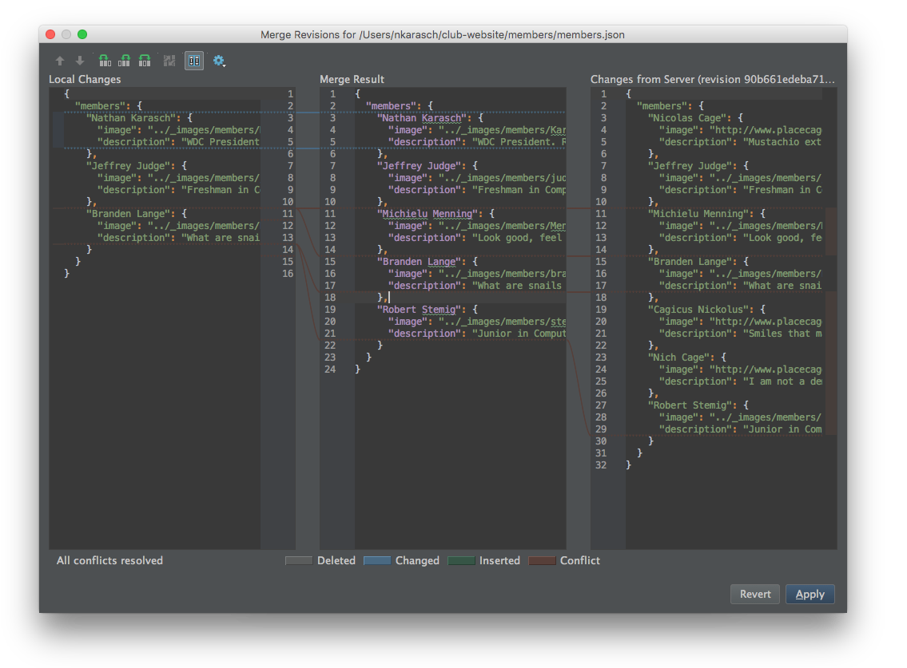

# Handling Merge Conflicts

 by Nathan Karasch - uploaded # Oct 2015

## Created a pull request and ran into this?

Don't worry! Though sometimes daunting (and almost always annoying), merge conflicts are an inevitable part of
collaborative programming. No matter how much you try to avoid it, there will be times when two people are working on
the same piece of code at the same time. One person's code gets merged before the other, and suddenly the runner-up has
merge conflicts! These conflicts have to be resolved before merging your branch, because you don't want to overwrite
something your fellow collaborator spent his or her valuable time writing.

## How to Resolve Merge Conflicts Using SourceTree

### Step 1: Pull upstream/master into your local branch

### Step 2: Find the conflicting file(s)

### Step 3: Resolve the conflicts

### Step 4: Commit and push your branch

## Conclusion

