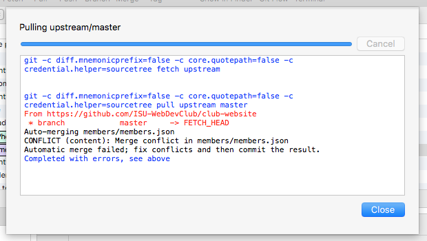
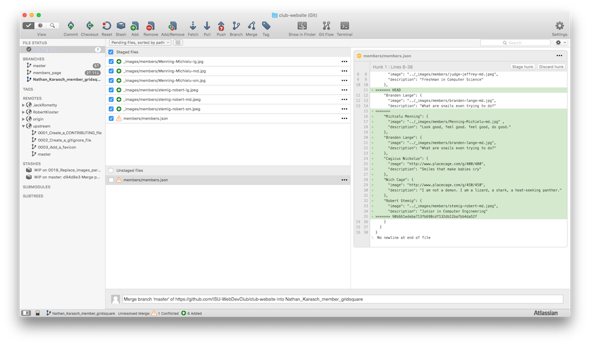
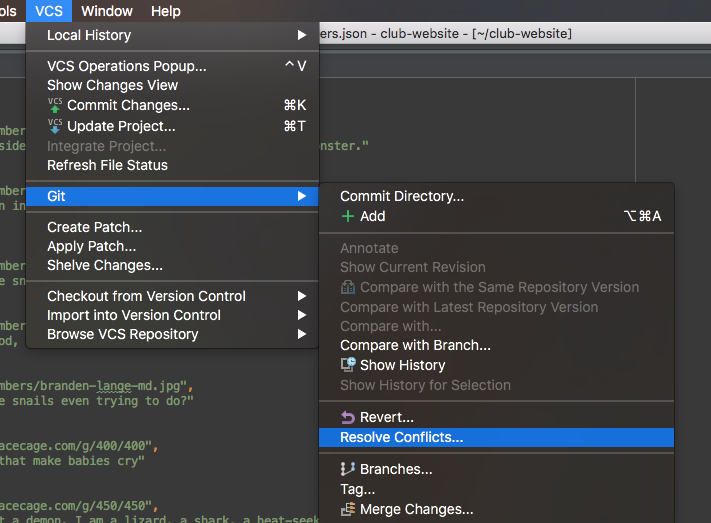
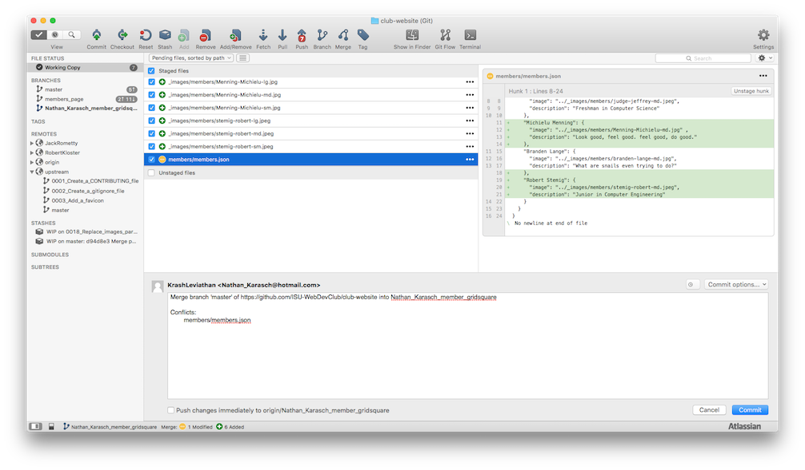

# Handling Merge Conflicts

 by Nathan Karasch - uploaded 8 Oct 2015

## Created a pull request and ran into this?

Don't worry! Though sometimes daunting (and almost always annoying), merge conflicts are an normal part of
collaborative programming. Merge conflicts occur when two people are trying to merge pieces of code into the repository
that change the same thing. The git version control system does its best to try to merge code together automatically,
but where there is room for doubt, it defers to the users to resolve the conflicts. In this tutorial I'll be talking
about how to handle merge conflicts using SourceTree and WebStorm.

## Is there a way to avoid having merge conflicts?

No matter how much you try to avoid it, there will inevitably be times when two people are working on the same piece
of code at the same time. One person's code gets merged before the other, and suddenly the runner-up has merge conflicts!
These conflicts have to be resolved before merging your branch, because you don't want to overwrite something your
fellow collaborator spent his or her valuable time writing.

That being said, there are some things you can do to make merge conflicts less frequent and less painful.

### Coordinate efforts

By splitting up the work in some way, you can try to avoid duplication of efforts. This is why it's important to use
some sort of ticketing system. We use the built-in Issues tracker in GitHub. It provides a way to let everyone know
what needs to be done, and (more importantly) who is taking charge of what. If Sue and Jerry both try to fix the same
bug or add the same feature, one of them is going to end up wasting their time. With tickets (issues), you can "lay
claim" to a certain bug or feature and avoid conflicts.

### Keep pull requests as light as possible

The bigger the pull request (more lines of code changed), the more likely it will conflict with someone else's work.
Give each bug or feature its own ticket instead of rolling a bunch of them together into one. It can turn into a huge
headache when you have a massive pull request that keeps hitting merge conflicts as other team members get their
pull requests merged.

### Communicate

Save yourself hours of wasted effort by communicating with your team! If you *know* you'll be working on the same
section of code as someone else, talk to them. They may want to wait to work on it until you're done, or vice versa.

## How to Resolve Merge Conflicts Using SourceTree

### Step 1: Pull upstream/master into your local branch

In SourceTree, ensure that you are working in the correct local branch, because when you pull another branch into it,
the changes will only affect the active branch. In the left sidebar under **Branches** you can see that
"Nathan_Karasch_member_gridsq..." is bolded, meaning it's the active branch.

If this is your first time pulling from the main repository, you'll need to add it

### Step 2: Find the conflicting file(s)

### Step 3: Resolve the conflicts

Basically, when you look at the members.json file you see there are three strange lines in there: <<<<<<<<< HEAD, =======,
and >>>>>>>> [gibberish]. The stuff in between the <<<< and >>>> is the stuff in conflict. The ==== separates the two conflicting pieces of code.
The stuff in the upper part is what's in your local branch (on your computer). The stuff in the lower part is what you're trying merged in.
You need to make them both work together, and then remove the <<<<, ====, and >>>> lines. So, in your case, you want to keep the
"Robert Kloster" items and the "Robert Stemig" items, but discard the Nic Cage stuff. I hope that's not too confusing. If it is,
wait until tomorrow and hopefully I'll have that how-to doc up for reference.

### Step 4: Commit and push your branch

## Conclusion

